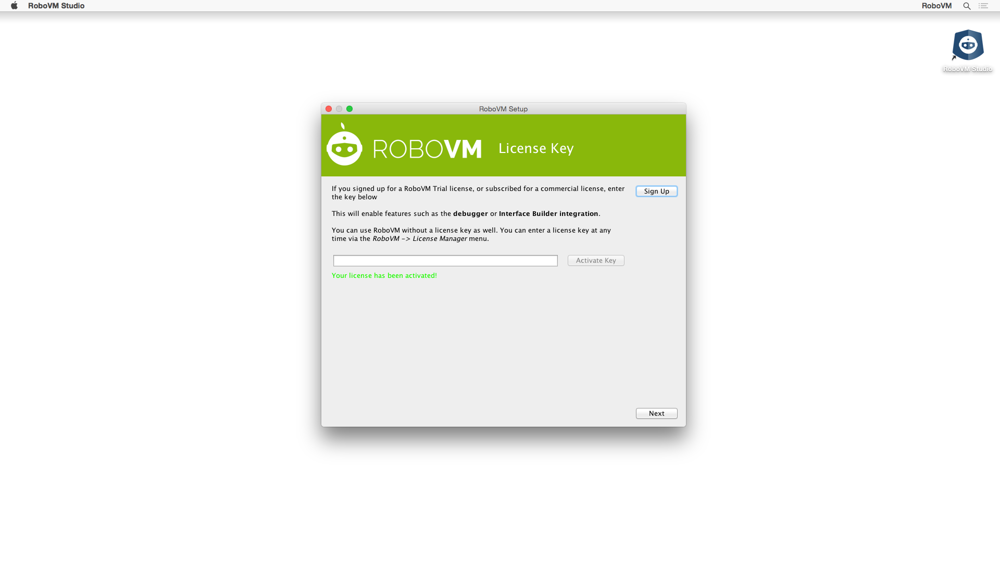
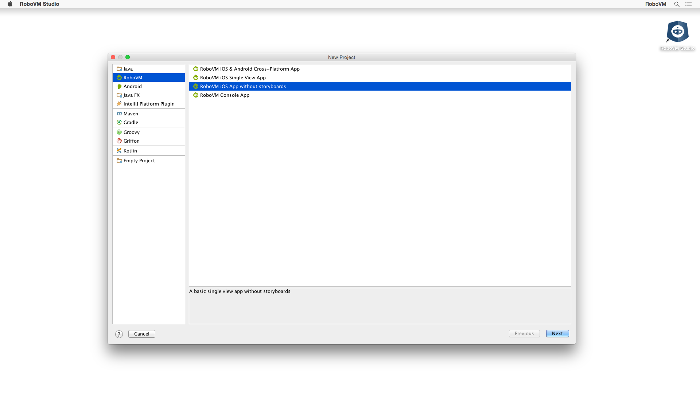
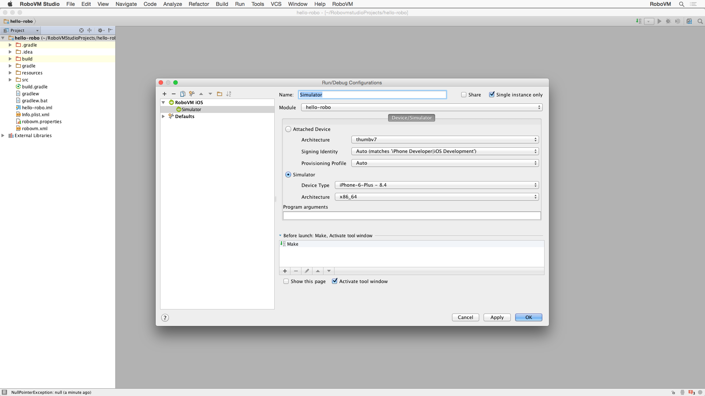
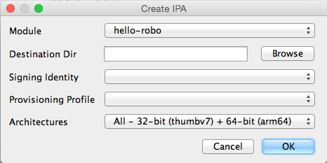

# Getting Started with RoboVM Studio

	<iframe frameborder="0" allowfullscreen src="https://www.youtube.com/embed/wwr3sMo-84s?rel=0"></iframe>

This section shows how to build and test RoboVM iOS applications using RoboVM Studio. It will explain how to activate your commercial license, create new iOS projects, build an iOS application and then compile, test and debug using the tools and interfaces you are already familiar with.

## Installing RoboVM Studio

Before installing, make sure to intall Xcode and Oracle's JDK 7+. RoboVM Studio will help you get everything else setup automatically the first time you open it. First it will ask you to point to the JDK you would like to use, which should be automatic. Then you can choose where it should install the android sdk, if you want to use RoboVM Studio for cross platform development. And finally you can input your license key if you have [http://www.robovm.com/pricing/](purchased a subscription) for one of RoboVM's subscription plans. Activating the license will enable the features you purchased, such as debugging support or Interface Builder integration.

> NOTE: A commercial license is not required to create RoboVM applications and deploy them to the App Store. Commercial licenses add additional features and services on top of the free core of RoboVM. For more information, visit our [pricing page](http://www.robovm.com/pricing/).

## Creating a New Project

Creating a new iOS project from within RoboVM Studio is pretty simple. Selecting __File > New > Project__ will open the dialog shown below, where you should choose _RoboVM iOS App without storyboards_.

The next two steps in the project wizard will allow you to customize your project with the following values:

1. _Package Name_, e.g. _com.mycompany.myapp_
2. _Main Class Name_, e.g. _Main_
3. _Application Name_, the name used when your app is installed to an iOS device or simulator
4. _Application Id_, a unique identifier, usually your package name
5. _Build System_, the tool to use for managing builds and dependencies

Finally, specify your _Project Name_ and _Project Location_.

### Running & Debugging

In order to run your newly created iOS application, you must first setup a _Run Configuration_. Navigating to __Run > Edit Configurations__, and clicking the '+' to add a _RoboVM iOS_ config, will open the dialog shown below.

You can create multiple configurations, one for each device and simulator you want to debug on. After closing the dialog, select the __Run__ menu and choose the configuration you just created.

> NOTE: The first time you run your application on the simulator or the device, RoboVM has to compile not only the classes of your app, but also any runtime classes required by your code. This can take some time. The next time you compile your app, RoboVM will only recompile the classes that have changed since the last compilation. You can view RoboVM's progress in the RoboVM console view.

When starting you app in debug mode, you have the full debugging tools of
RoboVM Studio at your disposal: you can set breakpoints, step into/out/over source
lines, inspect and set variables and even use [RoboVM Studio's Evaluate Expression view](https://www.jetbrains.com/idea/help/evaluating-expressions.html).

## Deployment

Once you are happy with your app and have tested it on multiple devices, it is time to publish it to the App Store. For this you need to create an [iOSApplication Archive](http://en.wikipedia.org/wiki/.ipa_%28file_extension%29) (IPA). You can do so from within RoboVM Studio by selecting __Build > Create IPA__.

Specify the output directory, your signing identity and provisioning profile and click _OK_. You will find a file with the extension `.ipa` in the output directory, which is ready to be uploaded to iTunes Connect via the Application Loader.

> NOTE: Please refer to [Apple's documentation](https://developer.apple.com/library/ios/documentation/LanguagesUtilities/Conceptual/iTunesConnect_Guide/Chapters/SubmittingTheApp.html) on how to submit your application.
