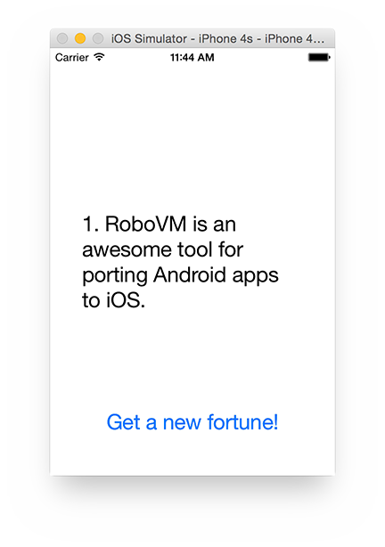

# Cross-Platform Basics

> NOTE: Although a valid license key is not needed for cross platform support, this tutorial makes use of Interface Builder integration which does. You can [sign up for a 14-day free trial](https://account.robovm.com/#/login) to test this feature.

## Introduction

One of RoboVM's greatest strengths is the opportunity to use the experience you have obtained with the JVM and Android in the creation of apps for iOS. Not only are you able to use the same familiar languages and libraries, but with a bit of planning, everything except UI and application code should be shareable between your Android and iOS applications.

This guide introduces how to architect a cross-platform application, while maximizing code re-use.

## Project Creation

For the moment, cross-platform project creation is in BETA. We currently only support [IntelliJ](../../getting-started/intellij.md) and the Gradle build system. This tutorial also assumes you have installed and configured the Android SDK and platform tools. __TODO: Link to a guide for this!__

> NOTE: A project wizard will be added soon that can be used to generate a fully working cross-platform project.

For now, the only way to create a cross-platform project is to manually setup the modules from within IntelliJ. At each step, if you are having problems, open the Gradle view (View > Tool Windows > Gradle) and press the `Sync` button.

### Android Module

Select File > New > Project > Android > Gradle Android Module:

* Page #1
	* Application Name: Fortune
	* Module Name: android
	* Package Name: com.mycompany.fortune.android
* Page #2
	* Choose Blank Activity
* Page #3
	* Activity Name: FortuneActivity
	* Layout Name: activity_fortune
* Page #4
	* Project Name: fortune

### iOS Module

Select File > New > Module > RoboVM > RoboVM iOS Single View App:

* Page #1
	* Package Name: com.mycompany.fortune.ios
	* Application Name: Fortune
	* App Id: com.company.fortune
	* Build System: Gradle
* Page #2
	* Module Name: ios

### Core Module

Select File > New > Module > Gradle

* Page #1
	* Artifact Id: core
* Page #2
	* Module Name: core

### Configuration

* Replace everything in `settings.gradle` with: `include ':android', ':ios', ':core'`
* Open `android/build.gradle` and `ios/build.gradle`. Add `compile project(':core')` under the `dependencies` section.
* __TODO: Either link to or spell out how to create a RoboVM Run Config__

## Simple Start

The app we will be creating is a version of the [unix fortune](http://en.wikipedia.org/wiki/Fortune_%28Unix%29) program. Each time the user presses a button, a random fortune will be displayed. The UI will be intentionally simple in order to focus on strategies for cross-platform development.



### Core

The core module should contain code that does not depend on the Android or iOS platforms. Typically, this will be comprised of the data and business logic layers.

Our model for the fortune app will start out with the simplest API possible, retrieving a random quote from a static database. In later sections we will expand that functionality to cover pulling new quotes from a web API, and saving your favorite quotes to a local database.

In the process, you will learn about using popular libraries from the Android ecosystem in a cross-platform way, and employing interfaces to allow each platform to inject functionality into the core module, e.g. local database storage.

For now, paste the following code into a new file named `FortuneStore.java` under the core module. Make sure there is a `org.robovm.fortune.core` package to place it in.

```java
package org.robovm.fortune.core;

import java.util.Random;

public class FortuneStore {
    private String[] fortunes = {
            "1. RoboVM is an awesome tool for porting Android apps to iOS.",
            "2. RoboVM is an awesome tool for porting Android apps to iOS.",
            "3. RoboVM is an awesome tool for porting Android apps to iOS.",
            "4. RoboVM is an awesome tool for porting Android apps to iOS.",
            "5. RoboVM is an awesome tool for porting Android apps to iOS.",
    };

    prive static Random rng = new Random();

    public String getFortune() {
        return fortunes[rng.nextInt(fortunes.length)];
    }
}
```

### Android UI

In order to design the Android UI, we will be taking advantage of the Android Designer within IntelliJ. In the project view, navigate to the android module > src > main > layout, and double click on `activity_fortune.xml`.

For now, all you really need is a `TextView` and a `Button`:

* Drag a `TextView` from the palette to the canvas.
	* Rename it 'fortuneTextView'
	* Configure the TextView
* Drag a `Button` from the palette to the canvas.
	* Rename it 'nextFortuneButton'
	* Configure the Button

Replace the contents of `FortuneActivity.java` under the `android` module with the following code.

```java
package org.robovm.fortune.android;

import android.app.Activity;
import android.os.Bundle;
import android.view.View;
import android.widget.Button;
import android.widget.TextView;
import org.robovm.fortune.core.FortuneStore;

public class FortuneActivity extends Activity {
    private FortuneStore fortunes = new FortuneStore(); // [:1:]

    @Override
    protected void onCreate(Bundle savedInstanceState) {
        super.onCreate(savedInstanceState);
        setContentView(R.layout.activity_fortune);

        final TextView fortuneLabel = (TextView) findViewById(R.id.fortuneTextView); // [:2:]
        final Button showFactButton = (Button) findViewById(R.id.nextFortuneButton); // [:2:]

        View.OnClickListener listener = new View.OnClickListener() { // [:3:]
            @Override
            public void onClick(View view) {
                fortuneLabel.setText(fortunes.getFortune());
            }
        };
        showFactButton.setOnClickListener(listener);
    }
}
```

[:1:] Create the model that we created in the core module.

[:2:] Get access to the UI elements we need.

[:3:] Hook up the click event on the button.

### iOS UI

Replace the contents of `FortuneViewcontroller.java` under the `android` module with the following code.

```java
package org.robovm.fortune.ios;

import org.robovm.apple.uikit.UILabel;
import org.robovm.apple.uikit.UIViewController;
import org.robovm.fortune.core.FortuneStore;
import org.robovm.objc.annotation.CustomClass;
import org.robovm.objc.annotation.IBAction;
import org.robovm.objc.annotation.IBOutlet;

@CustomClass("FortuneViewController")
public class FortuneViewController extends UIViewController {
    private static FortuneStore fortunes = new FortuneStore(); // [:1:]

    private UILabel fortuneLabel;

    @IBOutlet
    public void setLabel(UILabel label) { // [:2:]
        this.fortuneLabel = label;
    }

    @IBAction
    private void clicked() { // [:3:]
        fortuneLabel.setText(fortunes.getFortune());
    }
}
```

[:1:] Create the model that we created in the core module.

[:2:] Get access to the UI elements we need.

[:3:] Hook up the click event on the button.

## Web Request

> NOTE: Coming Soon

## Local Storage

> NOTE: Coming Soon

## Conclusion

> NOTE: Coming Soon
