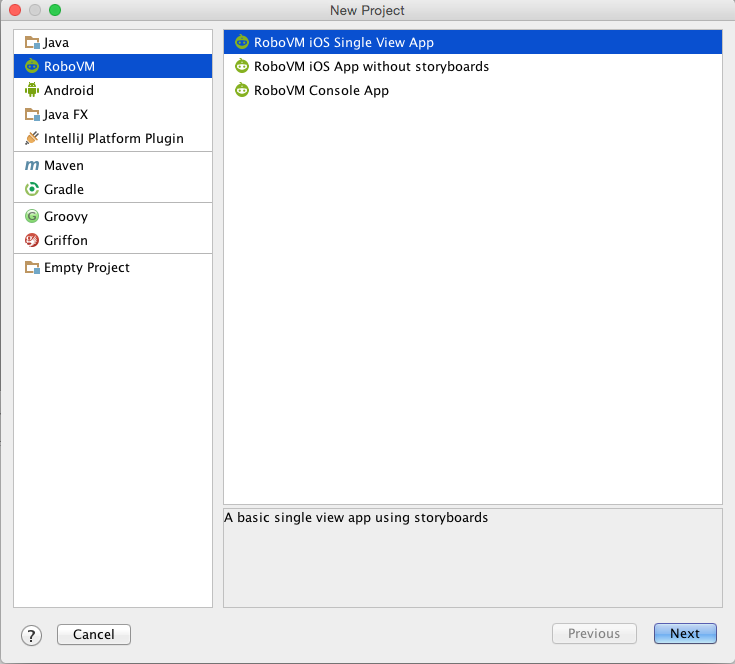
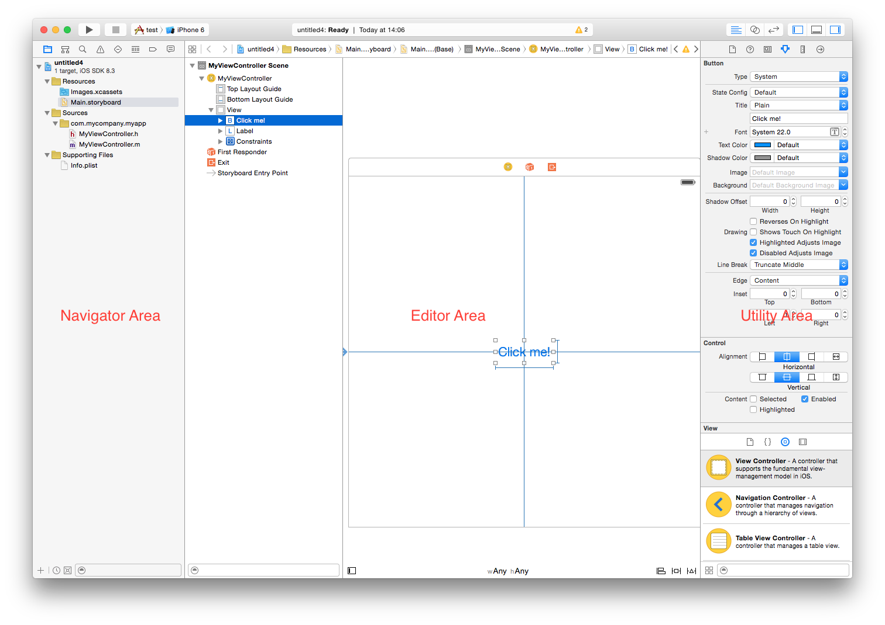
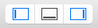
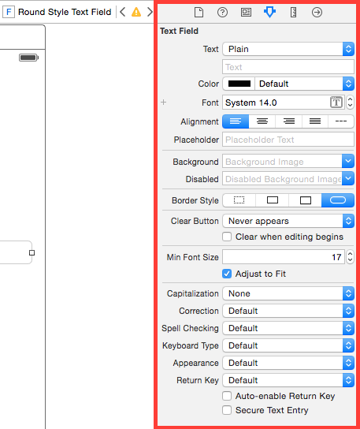
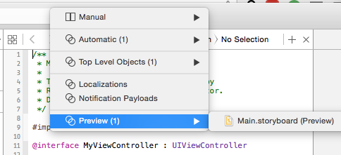
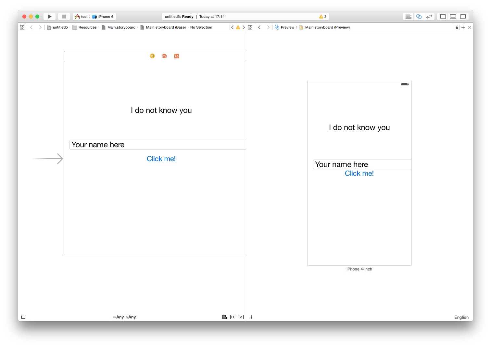
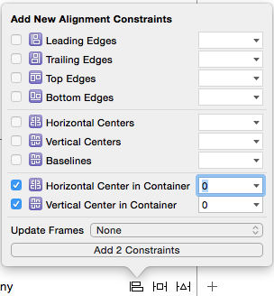
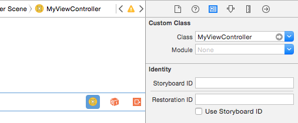
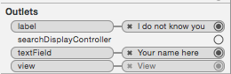
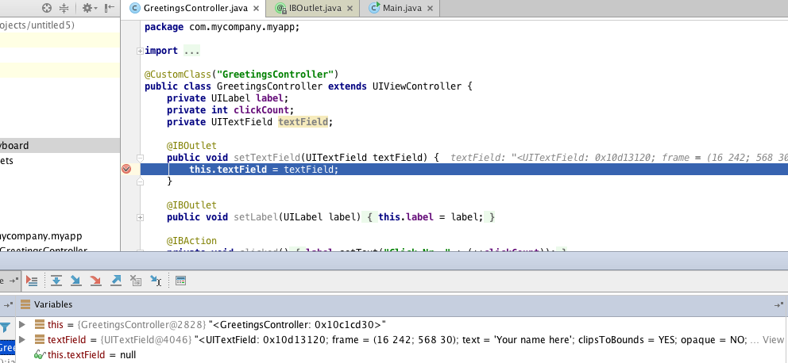

# Interface Builder Basics

> NOTE: You will need to have a valid license key to use Interface Builder integration. You can [sign up for a 14-day free trial](https://account.robovm.com/#/login) to test this feature.

<div class="video">
	<iframe frameborder="0" allowfullscreen src="https://www.youtube.com/embed/eQYu4ATQWi8?rel=0"></iframe>
</div>

This tutorial takes you through the process of creating a simple user interface with RoboVM using [Interface Builder](https://developer.apple.com/xcode/interface-builder/).

Interface Builder is part of Xcode and allows the creation of user interfaces for iOS apps via a WYSIWYG editor. User interfaces are usually defined in so called __storyboards__. A single storyboard can contain multiple __scenes__, each corresponding to a specific screen of your application. A scene is controlled by a __view controller__ which interacts with __views__ within the scene, such as buttons, labels, and text fields.

To accommodate different screen sizes, __[auto-layout](https://developer.apple.com/library/ios/documentation/UserExperience/Conceptual/AutolayoutPG/Introduction/Introduction.html)__ can be used, which lets you define the relationships between UI elements, such as their size and relative spacing.

At the end of the tutorial you'll have an understanding of:

 * How to create storyboard-based RoboVM iOS App
 * How the project is structured
 * How the app is started
 * The basics of Xcode and the integrated Interface Builder
 * The basics of auto-layouts
 * How to wire up storyboards with Java code via actions and outlets

We will transform the boring template from this:


To this amazing application:


Our app will allow a user to enter her name and click on the `Click Me!` button to see a nice personalized greeting.

Before you continue with this tutorial, we recommend going through the [Getting Started Guide](/getting-started/introduction.md), which demonstrates how to properly setup the development environment of your choice.

## Creating the Project

The RoboVM plugins for IntelliJ IDEA and Eclipse both come with project templates that support Interface Builder.

### IntelliJ IDEA



1. Go to __File -> New -> Project...__.
2. In the dialog, select _RoboVM_ from the left hand list.
3. Select _RoboVM iOS Single View App_ and click _Next_.
4. Fill out the basic information about the app and click _Next_.
5. Specify the name of the project and its location, click _Finish_.

The RoboVM plugin will then create the project with support for Interface Builder.

### Eclipse


1. Go to __File -> New -> RoboVM iOS Project__
2. In the dialog, specify the project's name.
3. Select _RoboVM iOS Single View App_ template selection.
4. Fill out the basic information about the app and click _Finish_. 

The RoboVM plugin will then create the project with support for Interface Builder.

## Project Structure

The project structure of a storyboard-based project is similar to the structure of a code-only project, described in the [Getting Started Guide](/getting-started/structure.md).

The differences include:

1. The `Info.plist.xml` file contains a key named `UIMainStoryboardFile` specifying the name of the storyboard file that will get loaded on startup.
2. [App icons](https://developer.apple.com/library/ios/documentation/UserExperience/Conceptual/MobileHIG/AppIcons.html) and [launch images](https://developer.apple.com/library/ios/documentation/UserExperience/Conceptual/MobileHIG/LaunchImages.html#//apple_ref/doc/uid/TP40006556-CH22-SW1) are located in `resources/Images.xcassets`.
3. Storyboard files and other Interface Builder artifacts are located in `resources/Base.lproj/`.

The project we created contains a storyboard file named `Main.storyboard`. It is referenced by the `Info.plist.xml` file under the `UIMainStoryboardFile` key with value `Main`.

## Code Structure & App Startup

The app consists of two classes: the main class and a view controller class. By using Interface Builder, both classes are significantly more simple compared to the code-only project from the getting started guide. 

### The Main class

Open the `Main.java` class:

```java
package com.mycompany.myapp;

import org.robovm.apple.foundation.NSAutoreleasePool;
import org.robovm.apple.uikit.UIApplication;
import org.robovm.apple.uikit.UIApplicationDelegateAdapter;
import org.robovm.apple.uikit.UIApplicationLaunchOptions;
import org.robovm.apple.uikit.UIScreen;
import org.robovm.apple.uikit.UIWindow;

public class Main extends UIApplicationDelegateAdapter {

    @Override
    public boolean didFinishLaunching(UIApplication application, UIApplicationLaunchOptions launchOptions) {
        return true;
    }

    public static void main(String[] args) {
        try (NSAutoreleasePool pool = new NSAutoreleasePool()) {
            UIApplication.main(args, null, Main.class);
        }
    }
}
```

The `UIApplicationDelegate` implementation does not explicitly setup any controllers or UI, as opposed to what was demonstrated in the [Getting Started Guide](/getting-started/structure.md) section. Instead, iOS will look into the `Info.plist.xml` file, find the `UIMainStoryboardFile` entry and automatically load the UI described by the file. On startup, the app will display the scene that is assigned to be the main entry point in the storyboard.

### The View Controller

Every scene in a storyboard has a `UIViewController` associated with it, responsible for implementing the logic of that scene. When the first scene of the main storyboard is loaded, iOS will also automatically instantiate the corresponding `UIViewController` associated with the scene.

Open the file `MyViewController.java`:
```java
package com.mycompany.myapp;

import org.robovm.apple.uikit.UILabel;
import org.robovm.apple.uikit.UIViewController;
import org.robovm.objc.annotation.CustomClass;
import org.robovm.objc.annotation.IBAction;
import org.robovm.objc.annotation.IBOutlet;

@CustomClass("MyViewController") // [:3:]
public class MyViewController extends UIViewController {
    private UILabel label;
    private int clickCount;

    @IBOutlet // [:1:]
    public void setLabel(UILabel label) {
        this.label = label;
    }

    @IBAction // [:2:]
    private void clicked() {
        label.setText("Click Nr. " + (++clickCount));
    }
}
```

[:1:] Instead of setting up views like labels and buttons manually, UI views defined in the storyboard scene will be injected into the view controller when the scene is loaded. This is achieved through __outlets__, which are simple getters/setters annotated with `@IBOutlet`, allowing us to get access to UI views from code.

[:2:] Instead of assigning listeners to views, like for receiving button clicks, the controller uses __actions__ to be notified about such events. This is achieved by annotating controller methods with the `@IBAction` annotation. This allows us to react to UI view events from code.

[:3:] When designing interfaces with Interface Builder, we visually connect views and their events with outlets and actions of the view controller. In order for this to work, Interface Builder needs to know the view controller's Objective-C class name. This can be indicated via the `@CustomClass` annotation, which allows you to specify the name that Interface Builder will refer to the view controller.

### Synchronizing the RoboVM Project with Xcode

Behind the scenes, RoboVM has to do additional work to make the bridge between Java code and Interface Builder work:

* RoboVM creates an Xcode project with references to the `Info.plist.xml` file, resources and view controllers.
* RoboVM translates a controller's Java class, its actions, and outlets into Objective-C header files. 
* RoboVM synchronizes changes between Xcode and the project bi-directionally, such as modifications to the `Info.plist.xml` file or changes to a view controller class.

All of this happens in the background. Every time you save changes to a relevant file in the project, RoboVM will update the Xcode or RoboVM project. You can catch a glimpse of this in the RoboVM console in Eclipse or IDEA:


## Xcode Basics

### Opening the Xcode Project

Both the RoboVM plugin for Eclipse and the plugin for IntelliJ IDEA allow you to open storyboard files from within the IDE.

* In Eclipse/IDEA, double click the `Main.storyboard` file in the `resources/Base.lproj/` folder _OR_ 
* In Eclipse/IDEA, right clicking the RoboVM module/project and selecting _Open Xcode Project_ from the context menu.



1. The __Navigator Area__ allows you to view the files within the Xcode project.
2. The __Editor Area__ displays the content of a file selected in the navigator area, using a content type specific UI.
3. The __Utility Area__ displays various properties of a selected object. An object can be a file selected in the navigator area or a UI view selected in the storyboard editor.

You can collapse the navigator and utility areas via the toolbar in the top right corner of Xcode



### Viewing a Storyboard

Select the storyboard file in the navigator. The editor area will display a WYSIWYG editor with the contents of the storyboard:


1. The __Outline View__ shows the contents of every scene in the storyboard in form of a tree. It is collapsible via the button in the bottom right corner.
2. The __Canvas__ allows you to visually modify the scenes.
3. The __Auto-layout Tools__ allow you to apply layout constraints to UI elements.

You can select view controllers, views, and constraints either by selecting them in the outline view or canvas.

You can delete elements by selecting them in either the outline view or the canvas and hitting the delete key.

You can zoom and pan the canvas using the mouse or touchpad. You can drag scenes around the canvas freely.

### Adding a View to a Scene

To add a new view to a scene in the storyboard, go to the __Object Library__ at the bottom of the utility area:


You can find various standard UI elements in there like buttons, labels, and text fields. To add an element to the storyboard, simply drag it from the object library onto a scene in the canvas.

We want our user to be able to enter her name.

Add a text field to the scene:

1. Type `text` into the search bar at the bottom of the object library.
2. Drag the text field from the object library onto the scene.
3. Position the text field above the button, centering it horizontally by using the blue guides that appear.
4. Resize the text field to the left and right edge of the scene, stopping when you hit the blue padding guides.

The result should look something like this:


### Modifying View Properties

Once an element is selected, you can view and modify its properties in the __Inspector Pane__ in the utility area:



Via the inspector you can change view type dependent properties, such as font, color, and background images.

We want to indicate to our user that she has to enter her name in order for brilliant things to happen.

Modify the font size, add a placeholder text to the text field, and set a default text on the label:

1. Select the text field in the outline view or in the canvas.
2. In the inspector, set the `Placeholder` property to `Your name here`.
3. In the inspector, click the T-icon on the font property and change the size to 24.
4. Select the label in the outline view or in the canvas.
5. In the inspector, set the text field beneath the `Text` combo box to `I do not know you!`.

The result should look something like this:


### Previewing the UI

One way of previewing the UI is to start the app on a simulator or device. Another way to quickly preview it is to use the __Assistant Editor__ functionality:

1. Click on the assistant editor button in the top right toolbar.

  

2. In the breadcrumb part of the Assistant Editor, select the first crumb, then select `Preview (1)`, and finally select the storyboard file.

  

You will see something like this:



Within this preview area, there are a few actions you can now take to customize the views:

* Click on the plus icon in the bottom left corner of the preview to add other device types.

* Select a device and click the rotate button at the bottom of its frame to switch between portrait and landscape.

* Delete a device by selecting it and then pressing the delete key.

> NOTE: Previews are nice while iterating on your UI, but you should always test on a simulator or device. To run the app on a simulator or device, switch back to the Java IDE and run it from there. Launching your app via Xcode is not supported.

### Applying basic auto-layout constraints

Our app doesn't look great in the preview because the constraints on the UI views are not what we want. Let's try to fix this.

Interface Builder helps you design UIs for different screen sizes via auto-layout. Auto-layout uses __constraints__ to size and position UI views. A constraint puts the position and/or size of a UI view in relation to other elements or the scene itself.

Before applying constraints, let's define what our scene should look like:

* The `Click Me!` button should be centered vertically and horizontally. 
* The text field should be centered horizontally. It's left and right edges should be pinned to the left and right edges of the super view (which stretches the whole screen), with some spacing. It should also be placed relative to the top of the button, again with some spacing.
* The Label should be centered horizontally, it's left and right edges should be pinned to the left and right edges of the super view with some spacing, and it should also be placed relative to the top of the super view with some spacing.

Let's start by removing all constraints:

1. In the canvas or outline view, select one of the views.
2. In the canvas, click the `Resolve Auto Layout Issues` button.
3. From the context menu, select 'Clear Constraints' from the `All Views in My View Controller` category.
 

You should not see any constraints in the outline view anymore.

To center the `Click Me!` button vertically and horizontally:

1. Select the button in the canvas or outline view.
2. In the canvas, click the 'Align' button.
3. From the context menu, check the `Horizontal Center in Container` and `Vertical Center in Container` checkboxes.
 
 
4. Click the `Add 2 Constraints` button.

The canvas will now look like this:
 

The blue lines indicate that this UI view has a horizontal and vertical centering constraint applied.

The red and orange boxes tell us that there is something wrong with the auto-layout of this view. Let's find out what the problem is.

In the last step we applied new constraints to the button. This changed the button's location and size according to the auto-layout calculations. However, the location and size of our button on the canvas is different to the properties calculated by auto-layout. Interface Builder indicates this problem by:

1. Showing orange guides and rectangles in the canvas for the element that has a problem.
2. Showing a yellow, orange or red arrow icon in the outline view.


Click on the arrow icon:


Interface Builder tells us that the button is misplaced on the canvas. It expects a different position on the x-axis as well as a different width compared to what is currently visible in the canvas. Interface Builder can help you automatically resolve this issue. 

Click on the triangle to the right of the issue:


Interface Builder suggests the most probable fix for the issue. The location and size of a UI view are stored in what is called a __frame__. The frame, as calculated by auto-layout, is different than the frame of the button on the canvas. Interface Builder suggests to update the frame of the button to match the frame as calculated by the auto-layout calculations.

Click the `Fix Misplacement` button.

The red and orange outlines on the button are gone, and so is the arrow indicating auto-layout issues!

> NOTE: When you place or otherwise modify a UI view, always check for orange/red outlines or guide lines as well as that little arrow in the outline view. Resolve auto-layout issues as early as possible!

Let's position the text field relative to the button's top edge and the super view's edges:

1. Select the text field in the canvas or outline view.
2. In the canvas, click the `Pin` button.
3. From the context menu, click the left, right and bottom edges.
4. Click the `Add 3 Constraints` button.
 
 

The result will look like this:


The blue guide lines on the left and right represent our pinning constraints to the super view's edges, including margins. The little blue guide line between the text field and the button indicates that the text field will move with the button vertically, always keeping the set distance of 9 points.

Finally, let's layout the label:

1. Select the label in the canvas or outline view.
2. In the canvas, click the `Pin` button.
3. From the context menu, click the left, right and top edges.
4. Enter `0` for the left and right edges.
5. Click the `Add 3 Constraints` button.


Since we pinned the label to the left and right margin of the super view, the label's frame as calculated by auto-layout is different from its frame on the canvas. Interface Builder indicates this via the small badges with the text `+144`. We can resolve this just as we resolved the frame issue previously:

1. Click the yellow arrow in the outline view.
2. Click the triangle next to the issue.
3. Select `Update Frame`, then click `Fix Misplacement`.

Preview the app in the Assistant Editor with a few device types:


This looks like what we wanted!

### Specifying a Scene's View Controller

`My View Controller` is not really descriptive, so let's change it to something else:

1. In Eclipse/IDEA, open `MyViewController.java`.
2. Rename the class to `GreetingsController` (make sure the file is renamed as well).
3. Change the `@CustomClass` annotation to `GreetingsController`.

```java
package com.mycompany.myapp;

import org.robovm.apple.uikit.UILabel;
import org.robovm.apple.uikit.UIViewController;
import org.robovm.objc.annotation.CustomClass;
import org.robovm.objc.annotation.IBAction;
import org.robovm.objc.annotation.IBOutlet;

@CustomClass("GreetingsController")
public class GreetingsController extends UIViewController {
    private UILabel label;
    private int clickCount;

    @IBOutlet
    public void setLabel(UILabel label) {
        this.label = label;
    }

    @IBAction
    private void clicked() {
        label.setText("Click Nr. " + (++clickCount));
    }
}

```

Once you save your changes, RoboVM will update the Xcode project accordingly.

> NOTE: IntelliJ IDEA does not compile classes automatically when you change the source files. See the [Getting Started Guide for IntelliJ IDEA](/getting-started/intellij.md) on how to configure this behaviour!

Open Xcode, expand the `Sources` and click on the `GreetingsController.h` file. It will open in the editor area.

```objc
/**
 * GreetingsController.h
 * 
 * This file has been auto-generated by
 * RoboVM's Interface Builder Integrator.
 * DO NOT MODIFY!
 */

#import <UIKit/UIKit.h>

@interface GreetingsController : UIViewController

/**
 * IBOutlet label
 */
@property (weak, nonatomic) IBOutlet UILabel *label;

/**
 * IBAction clicked
 * Selector: clicked
 */
-(IBAction) clicked;

@end
```

This file was auto-generated by RoboVM when you saved the modifications to the Java class. This is what allows Interface Builder to know about our controllers, their outlets, and their actions.

Since we changed the name of the view controller, we need to reassign it in our scene:

1. In Xcode, open the `Main.storyboard` file by clicking on it in the navigator.
2. Select the view controller in the canvas by clicking the scene's title bar or in the outline.
3. In the utility area, open the __Identity Inspector__.
4. In the class field, select `GreetingsController` from the _Class_ drop-down.



When iOS loads the application, it will first load the main storyboard, which in turn will load the scene and trigger the instantiation of the `GreetingsController` class, both on the native and on the Java-side!

> NOTE: The constructors of view controllers instantiated via storyboards are currently not called. To initialize your controllers, override the `viewDidLoad()` method and perform any setup there. You can follow the progress on this issue on the [issue tracker](https://github.com/robovm/robovm/issues/894)

### Adding Outlets

We will need access to the text field from within our Java-based view controller. To achieve this, we need to create an outlet on the view controller.

Add the following code to `GreetingsController`:
```java
	private UITextField textField;

    @IBOutlet
    public void setTextField(UITextField textField) {
        this.textField = textField;
    }
```

To define an outlet in a Java-based view controller, create a setter (and optionally a getter) method following the Java bean naming conventions, annotated with `@IBOutlet`. The setter method must take exactly one parameter, with the type of the UI view you want to assign to the outlet. In this case, the type is `UITextField`, and likewise, the label is of type `UILabel`. You can also specify a super type like `UIView`. The optional getter must take no parameters and return a type according to the same typing rules as for the setter.

After you save the Java source file, RoboVM will update the corresponding Objective-C header file `GreetingsController.h`:

```objc
/**
 * IBOutlet textField
 */
@property (weak, nonatomic) IBOutlet UITextField *textField;
```

RoboVM added a property to the header file. The Java setter name is stripped of the `set` prefix and used as the name for the outlet in the Objective-C header.

Let's assign the text field to this outlet:
1. In Xcode, select the view controller in the outline view or canvas.
2. Open the __Connections Inspector__.
 
3. Click on the port next to the `textField` outlet and drag a line to the text field on the canvas or in the outline view.
 

The text field is now assigned to the outlet in our controller:
 

You can remove the assignment by clicking on the `x` in the connections inspector.

Let's start the app and see if the outlet is assigned:
1. In Eclipse/IDEA set a breakpoint in the `GreetingsController#setTextField` method.
2. Create a run configuration for the simulator or device.
3. Start the run configuration in debug mode.

And indeed, the breakpoint is hit, and the passed in `UITextField` is the one we defined in the storyboard:



### Adding Actions

Our Java-based view controller also has to react to events, such as a click on a button or when the content of a text field changes. We want to process changes to the text field value in addition to clicks on the `Click Me!` button. To achieve this, we need to create an action on the view controller.

Add the following code to the `GreetingsController`:
```java
    @IBAction
    private void textChanged() {
        label.setText("I see you typing!");
    }
```

To define an action in a view controller, create a method annotated with `@IBAction`. The method can have zero, one, or two parameters. The first _optional_ parameter is the sender of the event, e.g. our `UITextField`. The second optional parameter is a `UIEvent` which holds additional data for the event. In our case we went for the zero parameter action.

After you save a Java source file, RoboVM will update the corresponding Objective-C header file `GreetingsController.h`:

```objc
/**
 * IBAction textChanged
 * Selector: textChanged
 */
-(IBAction) textChanged;
```

RoboVM added a method to the header file. The Java method name is used as the name for the action.

Let's assign the text changed event of the text field to this action:
1. In Xcode, select the view controller in the outline view or canvas.
2. Open the connections inspector.
3. Click on the port next to the `textChanged` outlet and drag a line to the text field on the canvas or in the outline view.
  

4. From the popup dialog, select `Editing Changed`.
 

The text changed event is now assigned to the action in our controller:
 

When the user types in the text field, the `GreetingsController#textChanged()` method will be called:

## Finishing Touches

Our app is almost complete. The only thing left to do is modify the controller code such that we assign a greeting text to the label when the `Click Me!` button is pressed. The final code of `GreetingsController` looks like this:

```java
package com.mycompany.myapp;

import org.robovm.apple.uikit.UILabel;
import org.robovm.apple.uikit.UITextField;
import org.robovm.apple.uikit.UIViewController;
import org.robovm.objc.annotation.CustomClass;
import org.robovm.objc.annotation.IBAction;
import org.robovm.objc.annotation.IBOutlet;

@CustomClass("GreetingsController")
public class GreetingsController extends UIViewController {
    private UILabel label;
    private UITextField textField;

    @IBOutlet
    public void setTextField(UITextField textField) {
        this.textField = textField;
    }

    @IBOutlet
    public void setLabel(UILabel label) {
        this.label = label;
    }

    @IBAction
    private void clicked() {
        String name = textField.getText();
        if (name.isEmpty()) {
            name = "Unknown";
        }
        label.setText("Hello " + name + "!");
    }

    @IBAction
    private void textChanged() {
        label.setText("I see you typing!");
    }
}
```

Our application looks like this:


## Conclusion

In this tutorial you got to know the basics of RoboVM's Interface Builder integration. Using storyboards results in very concise code. Modifying the UI visually is also a lot easier than coding it by hand. Finally, RoboVM allowed you to do all your coding in Java!

With your new knowledge you can now check out the other tutorials, as well as Apple's official documentation, to discover more!
