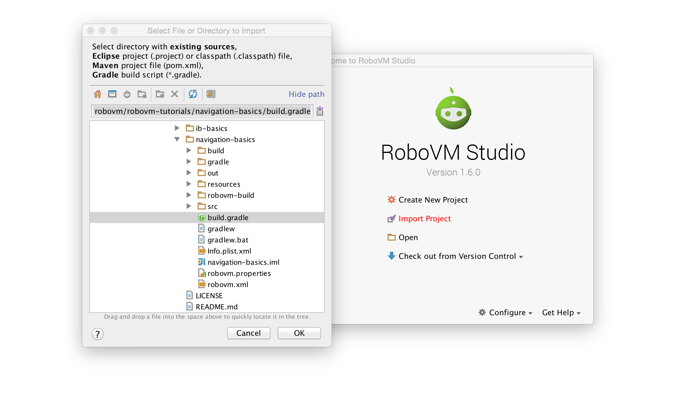

# Tutorials

In this section you find multiple tutorials that should get you up to speed with RoboVM and iOS development.

 * [Interface Builder Basics](ib-basics/ib-basics.md), demonstrates basic usage of interface builder
 * [Scene Navigation Basics](navigation-basics/navigation-basics.md), demonstrates how to create, navigate and pass data between multiple scenes
 * [Cross-Platform Basics](cross-platform/cross-platform.md), demonstrates how to setup and structure a project that shares code between iOS and Android

## Project Code

If you get stuck, we have provided a [repo](https://github.com/robovm/robovm-tutorials) containing the finished projects. All you need to do is check it out using git, then import them into RoboVM Studio.

