# Scene Navigation Basics

> NOTE: You will need to have a valid license key to use Interface Builder integration. You can [sign up for a 14-day free trial](https://account.robovm.com/#/login) to test this feature.

https://www.youtube.com/watch?v=1HHAy1o3NaM

This tutorial takes you through the process of creating multiple scenes, setting up the navigation between them and passing data to and from scenes.

At the end of this guide you will have an understanding of:

* How to create multiple scenes in your storyboard
* How to setup basic navigation between the scenes, both visually and programmatically
* How to pass data from one scene to the next

Based on the single view project template, we will create an app that:

* Lets the user enter a name in a text field
* Lets the user press a button so the app remembers that name
* Lets the user view a list of names the app remembered so far
* Lets the user edit already remembered names

Our app will consist of three scenes:

* The main scene will have a text field to enter a name to remember, a button that lets the user tell the app to remember the name, and another button to show the names the app remembered so far.
* The name list scene will show a list of remembered names as well as a back button to navigate back to the start screen.
* The editing scene will be shown when an item in the list is selected and let the user edit that item.

The final app will look like this:

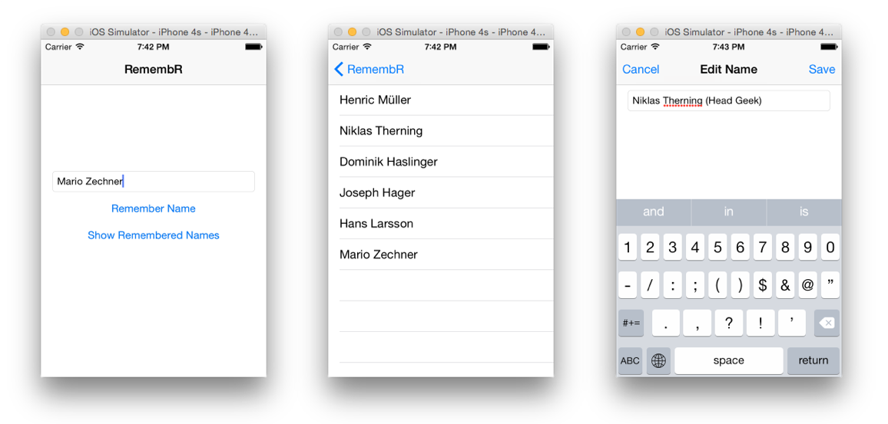

In this tutorial, we are picking up speed a little bit. You should already know the basics of Xcode and Interface Builder, how to add views to a scene and auto-layout them, and how to wire up your scene to your view controller via outlets and actions. Revisit [Interface Builder Basics](../ib-basics/ib-basics.md) if these concepts are not familiar to you yet.

## Project Creation

We will use the default single view app template project as our starting point.

### IntelliJ IDEA

1. Go to __ File -> New -> Project...___.
2. In the dialog, select _RoboVM_ from the left hand list.
3. Select _RoboVM iOS Single View App_ and click _Next_.
4. Fill out the basic information about your app and click _Next_.
5. Specify the name of your project and its location, click _Finish_.

The RoboVM Plugin will then create your project with support for Interface Builder.

### Eclipse

1. Go to __File -> New -> RoboVM iOS Project__.
2. In the dialog, specify your project's name.
3. Select _RoboVM iOS Single View App_ template selection. 
4. Fill out the basic information about your app and click _Finish_. 

The RoboVM Plugin will then create your project with support for Interface Builder.

## Setting up the First Scene

>TIP: Check out [Interface Builder Basics](../ib-basics/ib-basics.md) if the below instructions make no sense to you. Alternatively check out the video above!

1. Open up the main storyboard by double clicking it in your IDE. 
2. Remove the label and button from the scene by selecting them in the outline view or canvas and pressing the delete key.
3. From the object library, drag a button to the scene's center as indicated by the blue guide lines.
3. Double click the button in the canvas and change its label to `Remember Name`.
4. Select the button and choose __Editor -> Align -> Horizontal Center in Container__ from the top menu. You can also use the auto-layout buttons at the bottom of the canvas.
4. With the button still selected, choose __Editor -> Align -> Vertical Center in Container__ from the top menu. You can also use the auto-layout buttons at the bottom of the canvas.
3. From the object library, drag another button to the scene below the first button, so that its top edge aligns with the first button's bottom edge as indicated by the blue guide lines.
3. Double click the button in the canvas and change its label to `Show Remembered Names`.
4. With the button still selected, choose __Editor -> Align -> Horizontal Center in Container__ from the top menu. You can also use the auto-layout buttons at the bottom of the canvas.
4. With the button still selected, click the pin button in the auto-layout toolbar at the bottom of the canvas and pin the button to the bottom edge of the first button.
5. From the object library, drag a text field to the scene above the `Remember Name` button, so that its bottom edge alights with the `Remember Name` button's top edge.
6. Expand the text field to the left and right edge margins of the super view.
7. With the text field still selected, go to the attributes inspector and change the text field's placeholder text to `Enter name`.
4. With the text field still selected, choose __Editor -> Align -> Horizontal Center in Container__ from the top menu. You can also use the auto-layout buttons at the bottom of the canvas.
4. With the text field still selected, click the pin button in the auto-layout toolbar at the bottom of the canvas and pin the text field to the top edge of the `Remember Me` button and the left and right edge of the super view.

Your scene should look something like this:


Next, we modify the view controller in preparation for assigning outlets and actions:

1. In Eclipse/IDEA, open `MyViewController.java`.
2. Rename the class to `MainSceneController`, make sure you also change the `@CustomClass` annotation as well as the file name.
3. Remove all fields and methods.
4. Add the following fields and methods and import any missing classes.

```java
@CustomClass("MainSceneController")
public class MainSceneController extends UIViewController {
    private UITextField textField; // [:1:]
    private List<String> names; // [:2:]

    @Override
    public void viewDidLoad() { // [:3:]
        super.viewDidLoad();
        names = new ArrayList<String>();
    }

    @IBOutlet
    public void setTextField(UITextField textField) { // [:4:]
        this.textField = textField;
    }

    @IBAction
    public void rememberName() { // [:5:]
        String name = textField.getText().trim();
        if(!name.isEmpty()) {
            names.add(name);
            this.textField.setText("");
        }
    }
}
```

[:1:] `textField` will be assigned via an outlet. We need a reference to it to react to a touch on the `Remember Name` button.

[:2:] `names` is our "data storage". In a real-world application you would store this into a SQL-Lite database on the device or save the data to the cloud.

We loosely follow the [Model-View-Controller](https://developer.apple.com/library/ios/documentation/General/Conceptual/DevPedia-CocoaCore/MVC.html) pattern: `names` would be our model, the scene would be our view, and `MainSceneController` is the controller responsible for synchronizing the model and the view.

[:3:] The controller overrides the `viewDidLoad()` method of `UIViewController`. This allows us to initialize the `names` array once the super view of the scene is loaded.

[:4:] Next, we have an `@IBOutlet` via which we will inject the text field into the controller.

[:5:] Finally, we have an `@IBAction` that lets us react to a click on the `Remember Name` button. We do some sanity checking on the contents of the text field, e.g. if the users has entered anything at all. If that check passes, we store the name in our "model" and reset the text field contents.

> NOTE: The constructors of view controllers instantiated via storyboards are currently not called. To initialize your controllers, override the `viewDidLoad()` method and perform any setup there. You can follow the progress on this issue on the [issue tracker](https://github.com/robovm/robovm/issues/894).

To finish the setup of our main scene, we need to assign our new view controller, the outlets and actions:

1. In Xcode, select the view controller in the outline view.
2. In the identity inspector, select `MainSceneController` as the class in the _Custom Class_ group.
2. In the connections inspector, locate the `textField` outlet and drag a line from the dock to the text field on the canvas.
3. In the connections inspector, locate the `rememberName` action and drag a line from the dock to the `Remember Me` button on the canvas.
4. From the context menu select `Touch Up Inside`.

You can check your progress by running the app from within Eclipse/IDEA. You should see something like this:

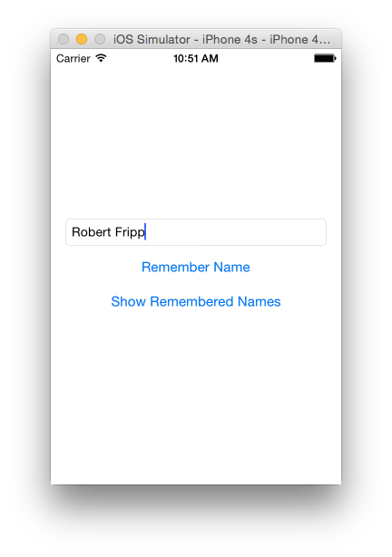

When you enter a name in the text field and press the `Remember Name` button, the text field should be cleared. In the background, the name will also be stored into the `names` list. We want to display this list in a separate scene when a user touches the `Show Remembered Names` button. For this we'll need a second scene.

## Setting up the Second Scene

The goal of our app is to display list of remembered names. For this we can use a [`UITableView`](https://developer.apple.com/library/ios/documentation/UserExperience/Conceptual/TableView_iPhone/AboutTableViewsiPhone/AboutTableViewsiPhone.html#//apple_ref/doc/uid/TP40007451-CH1-SW1), a view specifically tailored towards displaying lists of things. A `UITableView` is controlled by a [`UITableViewController`](https://developer.apple.com/library/prerelease/ios/documentation/UserExperience/Conceptual/TableView_iPhone/TableViewAndDataModel/TableViewAndDataModel.html#//apple_ref/doc/uid/TP40007451-CH5-SW1), which provides the view with the items to display, based on some data source.

>NOTE: In this tutorial, we'll only glance over the details of table views. The next tutorial will give you a deeper understanding of both `UITableView` and `UITableViewController`.

Let's create a second scene with a `UITableView` and a `UITableViewController`:

1. In Xcode, find the __Table View Controller__ in the object library.
2. Drag the table view controller onto an empty space on the canvas, next to the main scene.

3. In Eclipse/IDEA, create a new class called `NameListController` in the same package as the `MainSceneController`.
4. Copy the following code to the class.

```java
@CustomClass("NameListController")
public class NameListController extends UITableViewController {
    private List<String> names; // [:1:]

    public void setNames(List<String> names) { // [:2:]
        this.names = names;
    }

    @Override
    public void viewDidLoad() { // [:3:]
        super.viewDidLoad();
        names = Arrays.asList("Richard Feynman", "Albert Einstein");
    }

    @Override
    public long getNumberOfSections(UITableView tableView) { // [:4:]
        return 1;
    }

    @Override
    public long getNumberOfRowsInSection(UITableView tableView, long section) { // [:5:]
        return names.size();
    }

    @Override
    public UITableViewCell getCellForRow(UITableView tableView, NSIndexPath indexPath) { // [:6:]
		int row = (int)indexPath.getRow();
        UITableViewCell cell = tableView.dequeueReusableCell("NameListCell"); // [:7:]
        if(cell == null) {
            cell = new UITableViewCell(UITableViewCellStyle.Default, "NameListCell"); [:8:]
        }
        cell.getTextLabel().setText(names.get(row)); // [:9:]
        return cell;
    }
}
```

[:1:] The controller stores the data it should display in the table view in the `names` field.

[:2:] We provide a setter for the names which will be used to pass data into the controller when we navigate to it.

[:3:] We override `viewDidLoad()` to create dummy data. That data will get overwritten when the setter is called.

[:4:] The `getNumberOfSections()` method is part of `UITableViewController`. A table view can display multiple sections, each with its own set of items to display. We only have one section, so we return `1`.

[:5:] The `getNumberOfRowsInSection()` method is also part of `UITableViewController`. It returns the number of rows (items) of a specific section. We only have one section, so we simply return the number of names in our list.

[:6:] The `getCellForRow()` method is the last method of `UITableViewController` we override. It is passed an `NSIndexPath` which encodes the section and row for which we should return a `UITableViewCell`. A cell is the visual representation of a row in the table view. Every time a new row is about to become visible on the screen, e.g. because of scrolling, this method will be called and return a cell corresponding to the specified row.

[:7:] To reduce resources required to display a long, potentially infinite table view, we can ask the table view to give us a reusable cell by calling `UITableView#dequeueReusableCell()`. The table view pools cells internally. You can have custom cell types in your application which are assigned a name. You can design these cells in Interface Builder. The default cell type is sufficient for us, as it is able to display a text in a label. We need to give this cell type, also called a prototype cell, a name in Interface Builder later, so we can dequeue it via that name in the table view controller.

[:8:] If the table view has no cells pooled yet, we need to create one ourself. We use a default cell with the same identifier that is used for dequeuing.

[:9:] Once we have a `UITableViewCell`, we can set the name for that row as the label of the cell.

Let's set the name of the prototype cell for dequeuing and also assign our view controller to the scene:

1. In Xcode, select the _Table View Cell_ in the outline view.
 
2. In the identity inspector, set the __Restoration ID__ to `NameListCell`.
 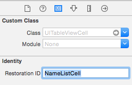
3. Select the table view controller in the outline view.
4. In the identity inspector, set `NameListController` as the class.

Let's test our controller. The storyboard entry point currently points to our main scene. Let's change this temporarily and fire up the app in the simulator:

1. In Xcode, drag the storyboard entry point arrow from the main scene over to the list scene.
 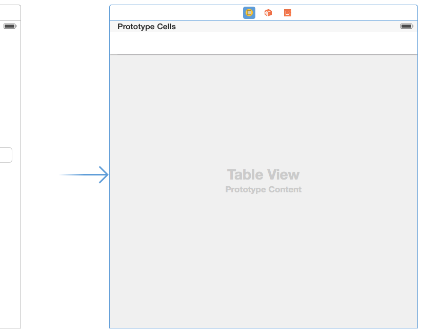
2. In Eclipse/IDEA, create a run configuration if you don't have one yet, and start the app on the simulator or device.
3. After you are done inspecting the scene in the simulator or on the device, __move the storyboard entry point arrow back to the main scene__!

You should see this:

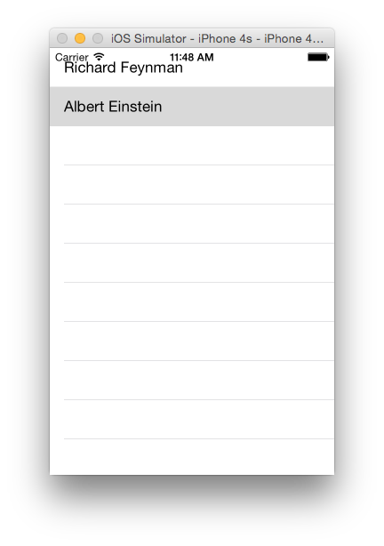

## Adding a Navigation Controller

A [navigation controller](https://developer.apple.com/library/ios/documentation/WindowsViews/Conceptual/ViewControllerCatalog/Chapters/NavigationControllers.html) manages a stack of view controllers, usually used for drill-down interfaces of hierarchical content. The navigation controller has views of its own that provide means to navigate between scenes and their controllers. The navigation controller embeds the view hierarchy of the controllers it manages. Embedded view controllers are also called content view controllers.

Let's embed our main scene in a navigation controller:
1. In Xcode, select the main scene controller.
2. In the top menu, go to __Editor -> Embed In -> Navigation Controller__.

You should see this in the canvas:


The navigation controller is now the storyboard entry point. Our main scene controller is the root view controller of the navigation controller, that means it is the first controller to be displayed.

## Modifying the Navigation Bar Title

A navigation controller can have a navigation bar at the top and a toolbar at the bottom. Content view controllers will be embedded between those two bars.

Looking at the main scene, you can see that Interface Builder is displaying a navigation bar at the top of the scene. This is because Interface Builder knows that this scene is embedded in a navigation controller.

Navigation bars enable users to navigate the hierarchy of scenes. Users start at the root view controller managed by the navigation controller and drill down further into new content view controllers. The navigation controller manages a stack of these content view controllers and will push and pop them as necessary depending on user input.

For each scene that's managed by a navigation controller, you can specify how the navigation and toolbar should look like. For our main scene, we want to have a descriptive name displayed in the navigation bar:
1. In Xcode, select the __Navigation Item__ of the main scene in the outline view or the canvas.
2. In the attributes inspector, enter `RemembR`, the hip name of our app, as the title.


You can see the change in the canvas:


## Adding a Segue

To navigate from one content view controller to another, we use [segues](https://developer.apple.com/library/ios/recipes/xcode_help-IB_storyboard/chapters/StoryboardSegue.html). A segue defines a transition from one controller to the next.

Segues are indicated via arrows between scenes in Interface Builder. You can add a segue from a UI view on one scene to another scene. You can also programmatically apply a segue.

A Segue has a source controller and a destination controller. The segue will perform a transition between the source and destination controller. Additionally, a segue has an identifier which we can use to handle segue transitions programmatically.

There are different types of segues which you can find in [Apple's documentation](https://developer.apple.com/library/ios/recipes/xcode_help-IB_storyboard/chapters/StoryboardSegue.html). In this tutorial we'll use __Show Segues__ and __Modal Segues__.

Show segues push a new view controller on the navigation stack, and generally have navigation and/or toolbars. The life-time of the new view controller will be managed by the navigation controller. Navigating from a list entry to a detail view is a good candidate for a show segue.

Modal segues are used when the scene you want to display isn't really part of the hierarchical content of your app and will not receive a navigation or toolbar. You have to manage the life-time of the new view controller yourself. Navigating from a list entry to a scene that lets you edit that entry is a good candidate for a modal segue.

Let's add a show segue between the `Show Remembered Names` button and the name list scene:

1. In Xcode, select the `Show Remembered Names` button.
2. Hold down the Ctrl-key, then drag a line from the button to the name list scene.
 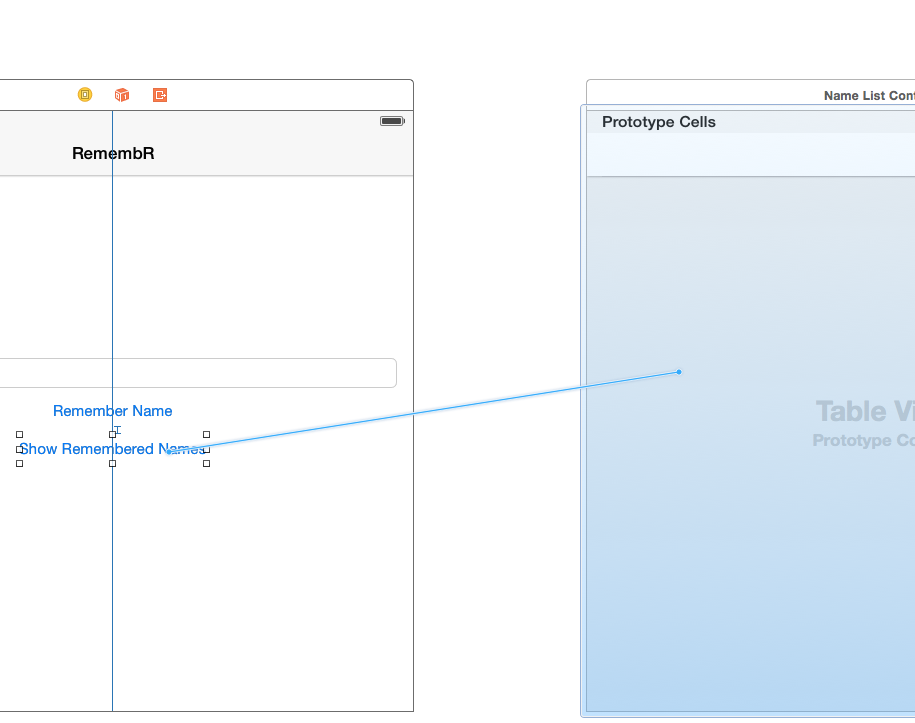
3. From the context menu, select `show`
 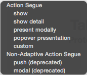
4. Select the segue in the canvas.
5. In the attributes inspector, set the segue's identifier to `ShowNames`.
 

You can now run the app on the simulator or on a device. If you touch the `Show Remembered Names` button, the segue is applied and the name list scene will be shown:


The name list scene automatically received a back button on the left side of the navigation bar. Clicking on that back button will bring us back to the main scene.

## Passing Data between View Controllers

The table view in the name list scene is still populated with dummy data. Our real data resides in the main scene controller. We need to call `NameListController#setNames()` before the segue is invoked. 

Before a segue is fully executed, it will call `prepareForSegue()` on its source view controller. At this point, both the source view controller and destination view controller are available to us. We can use this mechanism to set our "model" stored in the main scene controller on the name list controller. The main scene controller plays the role of the source view controller, the name list controller is the destination view controller of the segue. We therefore override the `prepareForSegue()` method in the main scene controller:

1. In Eclipse/IDEA, open the `MainSceneController` class.
2. Add the following method to the class.
```java
    @Override
    public void prepareForSegue(UIStoryboardSegue segue, NSObject sender) { // [:1:]
        super.prepareForSegue(segue, sender); // [:2:]
        if(segue.getIdentifier().equals("ShowNames")) { // [:3:]
            NameListController nameListController = (NameListController)segue.getDestinationViewController(); // [:4:]
            nameListController.setNames(names); // [:5:]
        }
    }
```

[:1:] The `prepareForSegue()` method takes the segue and the sender object as its parameters. The segue contains references to the source and destination controller as well as its id. The sender allows UI element that triggered the segue, in our case the `Show Remembered Names` button.

[:2:] We call the super implementation of `prepareForSegue()`, which might do extra work if we subclass specific types of controllers.

[:3:] Next we compare the identifier of the segue with `ShowName`, which is the identifier we gave to the segue in Interface Builder. If a scene has multiple segues, we need to be able to differentiate between them in the view controllers `prepareForSegue()` method.

[:4:] We retrieve the `NameListController` from the segue and...

[:5:] ...supply it with the names the user has entered so far.

Finally, we can remove the creation of dummy data in `NameListController#viewDidLoad()`:

1. In Eclipse/IDEA, open the `NameListController` class.
2. Remove the `viewDidLoad()` method.

You can now run the app:

1. Run the app from within Eclipse/IDEA.
2. Enter a name in the text field and press "Remember Name", repeat this a few times.
3. Click on "Show Remembered Names" to display the list of names entered so far.

Here's the name list after entering a few fantasy names:

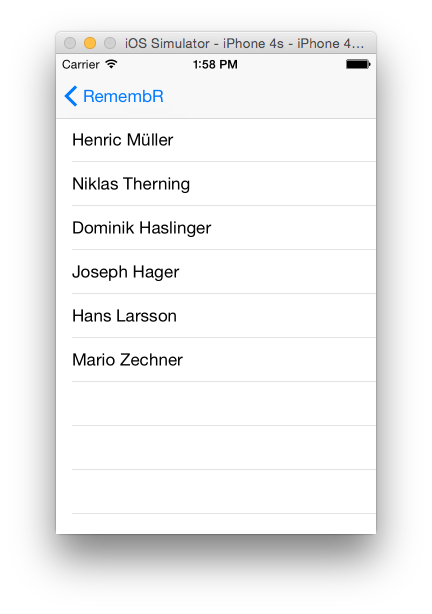

## Editing List Entries

A user might want to edit entries in the list, for example if she made a typing error when adding a name to the list.

### Adding an Editing Scene

Let's add a new scene that will let the user edit an item in the list. The scene will contain a text field, pre-filled with the name from the list:

1. In Xcode, drag a view controller from the object library onto the canvas to the left of the name list scene.
2. From the object library drag a text field onto the canvas so it aligns with the top margin of the super view.
3. Expand the text field to the left and red margins of the super view.
4. Add a constraints to pin the text field to the top, left and right margins of the super view.

You should end up with the following:

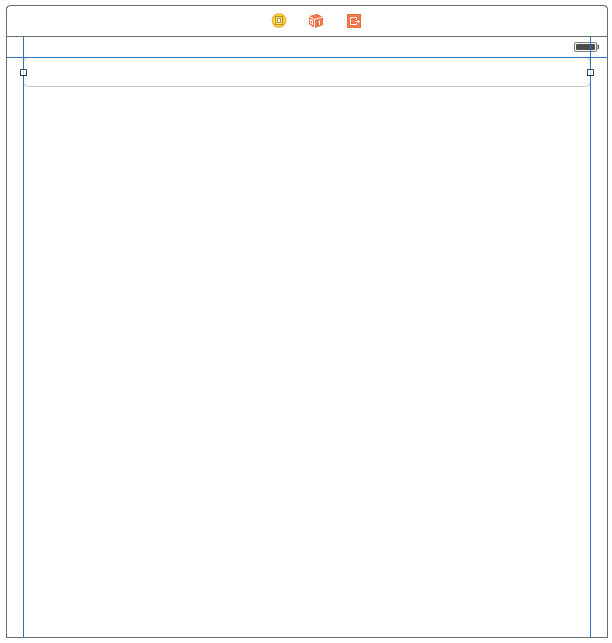

### Adding a Segue from a Table Cell to the Editing Scene

Next we want to add a segue so that if a table cell (and hence name) is touched, the editing scene is loaded, displaying the selected name for editing. The segue we create will be a modal segue, as we will perform some editing instead of showing a drill-down scene.

1. In the outline view or canvas, select the table view cell of the name list scene.
2. Ctrl-drag a line from the table view cell to the editing scene.
 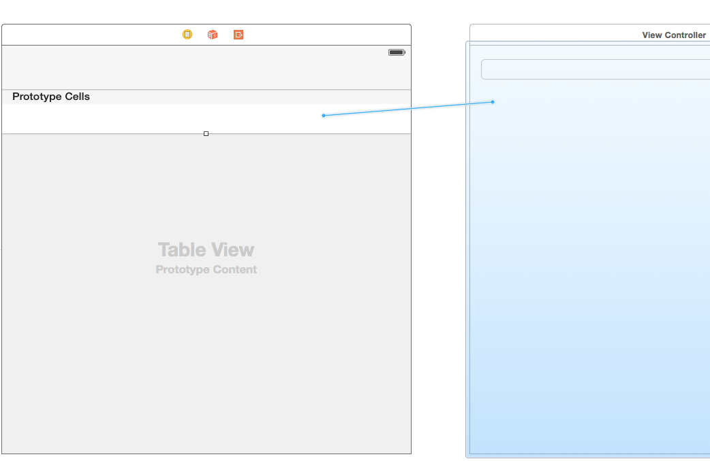
3. From the context menu, select __Selection Segue -> Present Modally__.
 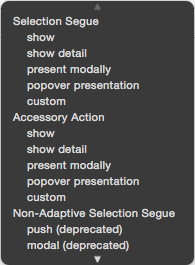
4. Select the new segue in the canvas.
5. In the attributes inspector, set the segue identifier to `EditName`.

If you run your app, add a name and select it from the list, you well end up in the editing scene:


This is a bit of a dead-end. We can't navigate back to where we came from, and we also don't push any data to manipulate to the editing scene. Let's fix that.

### Adding a Navigation Bar to the Editing Scene

Since we are showing the editing scene via a modal segue, the scene does not get a navigation bar. We can fix that by embedding the editing scene in a view controller:
1. Select the editing scene view controller in the outline view or canvas.
2. In the top menu, go to __Editor -> Embed In -> Navigation Controller__.

Our editing scene is now embedded in a navigation controller and has its own navigation bar.


But wait, our text field is now gone! Actually, it's still there, but the auto-layout hasn't updated the canvas frame of the text field automatically. We can see that there's an auto-layout problem in the outline view: a yellow arrow reminds us that something is wrong. To resolve the issue:

1. Click the yellow arrow in the outline view.
2. Click the yellow triangle in the next view.
3. Click 'Fix Misplacement'.

Our text field is not placed below the navigation bar as expected. Let's quickly add some space between the text field and the navigation bar:

1. Drag the text field down-wards a little until you see a horizontal blue guide line, keeping it centered horizontally.
2. Click on the _Resolve Auto-Layout Issues_ button at the bottom right of the canvas.
3. Select __Selected Views -> Update Constraints__.

This will modify the spacing of the top edge constraint we added previously.


### Adding Bar Buttons

Next we want to add a `Cancel` button on the left side of the navigation bar and a `Save` button on the right side of the navigation bar. We can't add a normal `UITextButton` to a navigation bar. Instead we need to add a __Bar Button Item__:
1. From the object library, drag a bar button item onto the left side of the navigation bar. A blue outline will indicate where you can place the button.
2. Double-click the button and enter `Cancel` as its label.
3. From the object library, drag a bar button item onto the right side of the navigation bar. A blue outline will indicate where you can place the button.
4. Double-click the button and enter `Save` as its label.
5. Select the navigation item in the outline view or canvas and set its title to `Edit Name` in the attributes inspector.

You should end up with a scene like this:

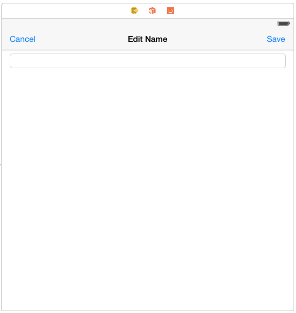

If you run the app, you can add a few names, then select one from the list. However, we do not pass the "model" over to the editing scene yet. The `Cancel` and `Save` buttons to nothing either.

### Passing Data from the Name List Scene to the Editing Scene

It's time to pass the selected name from the name list scene to the editing scene. First we need to create a new view controller for the editing scene:

1. In Eclipse/IDEA, create a new class called `EditingController`.
2. Copy the following code to the class file.

```java
package com.mycompany.myapp;

import org.robovm.apple.uikit.UITextField;
import org.robovm.apple.uikit.UIViewController;
import org.robovm.objc.annotation.CustomClass;
import org.robovm.objc.annotation.IBOutlet;

@CustomClass("EditingController")
public class EditingController extends UIViewController { // [:1:]
    private UITextField textField; // [:2:]
    private String nameToEdit; // [:3:]
    private int index; // [:4:]

    public void setNameToEdit(String nameToEdit, int index) { // [:5:]
        this.nameToEdit = nameToEdit;
        this.index = index;
    }

    public String getEditedName() { // [:5:]
        return textField.getText();
    }

	public int getIndex() { // [:6:]
        return index;
    }

    @IBOutlet
    public void setTextField(UITextField textField) { // [:7:]
        this.textField = textField;
    }

    @Override
    public void viewDidLoad() { // [:8:]
        super.viewDidLoad();
        textField.setText(nameToEdit);
    }
}
```

[:1:] The `EditingController` subclasses `UIViewController` as it will become the controller of our editing scene.

[:2:] `textField` stores a reference to the `UITextField` via which the user will edit the selected name. We'll receive that reference via an outlet.

[:3:] `nameToEdit` stores the name the user wants to edit.

[:4:] `index` stores the index of the name in the model. We'll need that later for saving the changes to the name list.

[:5:] The `setNameToEdit()` method will be called by the name list controller, so that the editing controller knows which name to edit.

[:6:] The `getEditedName()` method returns the modified name as entered into the text field by the user. We'll call this when we save the changes.

[:7:] The `getIndex()` method returns the list index of the name that's being edited. We'll call this when we save the changes.

[:8:] The `setTextField()` method is an outlet via which we get a reference to the text field in the editing scene.

[:9:] Finally, we override `viewDidLoad()`. At this point we have received the reference to the text field via the outlet and the name list controller will have told us which name to edit. We then simply set the name as the text of the text field in `viewDidLoad()`.

Let's wire our view controller and its outlet to the editing scene:

1. In Xcode, select the editing scene view controller in the outline view or canvas.
2. In the identity inspector, set `EditingController` as the class of the view controller.
3. Open the connections inspector and drag a line from the `textField` outlet dock to the text field on the canvas.

With all of this setup, we can now pass the selected name from the name list scene to the editing scene. Just like before, we override the `prepareForSegue()` method of the source controller of the segue, in this case the `NameListController`:

1. In Eclipse/IDEA, open the `NameListController`.
2. Add the following method to the class.

```java
    @Override
    public void prepareForSegue(UIStoryboardSegue segue, NSObject sender) {
        super.prepareForSegue(segue, sender);
        if(segue.getIdentifier().equals("EditName")) { // [:1:]
            int selectedRow = (int)getTableView().getIndexPathForSelectedRow().getRow(); // [:2:]
            String name = names.get(selectedRow); // [:3:]
            UINavigationController navController = (UINavigationController)segue.getDestinationViewController(); // [:4:]
            EditingController editingController = (EditingController)navController.getVisibleViewController(); // [:5:]
            editController.setNameToEdit(name, selectedRow); // [:6:]
        }
    }
```

[:1:] We fist check if we got the correct segue by checking the identifier.

[:2:] Next, we fetch the currently selected row from the table view.

[:3:] With the row index in hand, we can fetch the selected name from the model.

[:4:] We get the `UIViewController` which is the destination of the segue. This navigation controller has our editing controller on its stack.

[:5:] From the navigation controller, we fetch our `EditingController`, which is the controller the navigation controller is currently showing.

[:6:] Finally, we set the name and index on the editing controller, so the user can edit the name.

If you run the app, add a name and select it in the list, you can now edit it. However, you still can not get back to the list view and save the modifications.

### Adding an Unwind Segue

When you present a scene modally, you are in charge of providing navigational elements. Our editing scene has two buttons that both should "unwind" back to the name list scene. To achieve this unwinding, we need to add an unwind segue. Unwind segues are also called exit segues. Unwind segues generally allow you to "go back" multiple steps in your navigation hierarchy with a single unwind action.

You can only unwind to view controllers that have a special action taking an `UIStoryboardSegue`. Since we want to unwind back to the name list, let's add an unwind action:

1. In Eclipse/IDEA, open the `NameListController` class.
2. Add the following method to the class.

```java
    @IBAction
    public void unwindToNameList(UIStoryboardSegue segue) {

    }
```

Unwind actions receives a `UIStoryboardSegue` as the sender. Unwind actions do not take a second parameter as opposed to other actions, like button click actions which also take a `UIEvent`.

We can now add an unwind segue for both the `Close` and `Save` buttons in the editing scene:

1. In Xcode, select the `Close` button in the outline view or canvas.
2. Ctrl-drag from the `Close` button to the exit symbol of the editing scene.
 
3. From the context menu, select `unwindToNameList`.
4. In the outline view, select the __Unwind Segue to Scene Exit Placeholder__.
5. In the attributes inspector, set the identifier to `EditCancel`.
4. Select the `Save` button and repeat the last four steps, using `EditSave` as the identifier of the segue.

If you run the app, add a name and select it from the list, you can now use the `Cancel` or `Save` button to go back to the name list. However, modifications you make in the editing scene are not reflected in the model nor in the table view.

### Updating the Model & Table View after Editing

Our last job is it to handle the modifications by the user in the editing scene and update the model and table view. When the user is done editing the name, she can either press the `Cancel` or the `Save` button. This will trigger the unwind segue and call the `unwindToNameList()` method on the `NameListController`. This is the place where we can save the modifications and update the table view:

1. In Eclipse/IDEA, open the `NameListController`.
2. Update the `unwindToNameList()` method with the following code.

```java
    @IBAction
    public void unwindToNameList(UIStoryboardSegue segue) {
        if(segue.getIdentifier().equals("EditSave")) { // [:1:]
            EditingController editingController = (EditingController)segue.getSourceViewController(); // [:2:]
            String name = editingController.getEditedName().trim(); // [:3:]
            if(!name.isEmpty()) { // [:4:]
                names.set(editingController.getIndex(), name);  // [:5:]
                getTableView().reloadData(); // [:6:]
            }
        }
    }
```

[:1:] We first check which unwind segue was triggered based on the segue's identifier. We ignore the `EditCancel` segue which is triggered when the user clicks the `Cancel` button. We only react to the `EditSave` segue, which is triggered when the user presses the `Save` button.

[:2:] Next we get the `EditingController`, which is the source controller of this segue.

[:3:] We fetch the edited name from the editing controller.

[:4:] Perform some sanity checking.

[:5:] Update the model.

[:6:] And tell the table view to reload the data.

Our app is now complete! If you run it, you can add names, view them in a list, and edit them.


## Conclusion

In this tutorial you got to know the basics navigation controllers, table views and their controllers, segues and how to pass data between controllers.

With your new knowledge you can now check out the other tutorials, as well as Apple's official documentation, to discover more!
