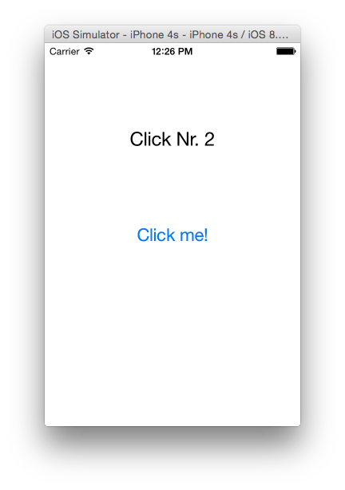
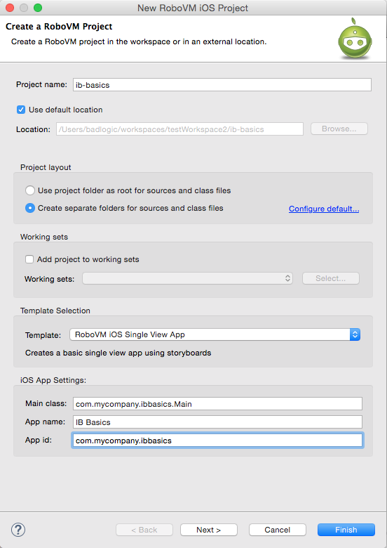

# Interface Builder Basics
> NOTE: You will need to have a valid license key to use Interface Builder integration. You can [sign up for a 30-day free trial](https://account.robovm.com/#/login) to test this feature.

This walkthrough takes you through the process of creating a simple user interface using [Interface Builder](https://developer.apple.com/xcode/interface-builder/) with RoboVM.

Interface Builder is part of Xcode and allows you to create the user interfaces of your iOS apps via a WYSIWG editor. User interfaces are usually defined in so called storyboards. A single storyboard can contain multiple scenes, each corresponding to a specific screen of your application.

To accommodate different screen sizes, [auto-layout](https://developer.apple.com/library/ios/documentation/UserExperience/Conceptual/AutolayoutPG/Introduction/Introduction.html) can be used which lets you define the relationships between your UI elements, such as their size, relative spacing and so forth.

At the end of the walkthrough you'll have an understanding of:

 * How to create storyboard-based RoboVM iOS App
 * How such a project is structured
 * The basics of Xcode with regards to Interface Builder
 * The basics of auto-layouts
 * How to wire up storyboards with Java code via actions and outlets

The end result will look something like this:



Before you continue with this walkthrough, we recommend going through the [Getting Started Guide](/getting-started/introduction.md) which shows you how to properly setup your development environment of choice.

## Creating the Project
The RoboVM plugins for Intellij IDEA and Eclipse both come with project templates that support Interface Builder.

To create a project in Intellij IDEA, go to __File -> New -> Project...__. In the dialog, select _RoboVM_ from the left hand list, then select _RoboVM IOS Single View App_ and click _Next_.


Next, fill out the basic information about your application and click _Next_. Finally, specify the name of your project and the location it should be saved to, then click _Finish_. The RoboVM Plugin will then create your project with support for Interface Builder.

To create a project in Eclipse, go to __File -> New -> RoboVM iOS Project__.



In the dialog, specify your project and iOS App Settings. Make sure to select the _RoboVM iOS Single View App_ template from the template selection. Finally, click _Finish_. The RoboVM Plugin will then create your project with support for Interface Builder.

## Project Structure
The project structure of a storyboard-based project is similar to the structure of a code-only project, as described in the [Getting Started Guide](/getting-started/structure.md). The biggest changes are:

1. In the `Info.plist.xml` file, a new key called `UIMainStoryboardFile` was added, with a value of `Main`. This is the name of the storyboard file that will get loaded automatically when app is started.
2. [App icons](https://developer.apple.com/library/ios/documentation/UserExperience/Conceptual/MobileHIG/AppIcons.html) as well as [launch images](https://developer.apple.com/library/ios/documentation/UserExperience/Conceptual/MobileHIG/LaunchImages.html#//apple_ref/doc/uid/TP40006556-CH22-SW1) have been moved to `resources/Images.xcassets` so we can directly edit them in Xcode.
3. A new folder called `resources/Base.lproj/` was added, containing any interface builder files, such as storyboards. There is already a file called `Main.storyboard` in there, which corresponds to the `UIMainStoryboardFile` that's specified in the `Info.plist.xml` file.

## Code Structure & App Startup
By specifying a `UIMainStoryboardFile` in the `Info.plist.xml` file, iOS will automatically load the storyboard on startup and display the scene from the storyboard that's defined as the storyboard entry point. All the UI views will be set up automatically, so neither the `UIApplicationDelegate` nor the `UIViewController` have to perform this task. This significantly simplies the code compared to creating UIs purely via code.

The main class looks like this:
```java
package com.mycompany.myapp;

import org.robovm.apple.foundation.NSAutoreleasePool;
import org.robovm.apple.uikit.UIApplication;
import org.robovm.apple.uikit.UIApplicationDelegateAdapter;
import org.robovm.apple.uikit.UIApplicationLaunchOptions;
import org.robovm.apple.uikit.UIScreen;
import org.robovm.apple.uikit.UIWindow;

public class Main extends UIApplicationDelegateAdapter {

    @Override
    public boolean didFinishLaunching(UIApplication application, UIApplicationLaunchOptions launchOptions) {
        return true;
    }

    public static void main(String[] args) {
        try (NSAutoreleasePool pool = new NSAutoreleasePool()) {
            UIApplication.main(args, null, Main.class);
        }
    }
}
```

The `UIApplicationDelegate` implementation does not explicitely setup any controllers or UI, as oposed to what was demonstrated in the [Getting Started Guide](/getting-started/structure.md) section. Instead, iOS will look into the `Info.plist.xml` file, find the `UIMainStoryboardFile` entry and automatically load the UI the file describes.

Every scene in a storyboard has a `UIViewController` associated with it, responsible for implementing the logic of that scene. When the first scene of the main storyboard is loaded, iOS will also automatically instantiate the corresponding `UIViewController` associated with the scene.

When opening up `MyViewController.java` you can see that the controller is significantly simpler as well:
```java
package com.mycompany.myapp;

import org.robovm.apple.uikit.UILabel;
import org.robovm.apple.uikit.UIViewController;
import org.robovm.objc.annotation.CustomClass;
import org.robovm.objc.annotation.IBAction;
import org.robovm.objc.annotation.IBOutlet;

@CustomClass("MyViewController") // [:2:]
public class MyViewController extends UIViewController {
    private UILabel label;
    private int clickCount;

    @IBOutlet // [:1:]
    public void setLabel(UILabel label) {
        this.label = label;
    }

    @IBAction // [:2:]
    private void clicked() {
        label.setText("Click Nr. " + (++clickCount));
    }
}
```

[:1:] Instead of setting up views like labels and buttons itself, UI views defined in the storyboard scene will be injected into the view controller when the scene is loaded. This is achieved through __outlets__, which are simple setters/getters annotated with `@IBOutlet`. This allows us to get access to UI views from within our code.

[:2:] Instead of assigning listeners to views, like for receiving button clicks, the controller uses __actions__ to get notified about such events. This is achieved by annotating controller methods with the `@IBAction` annotation. This allows us to react to events of UI views from within our code.

[:3:] When designing interfaces with Interface Builder, we visually connect views and their events with outlets and actions of the view controller. In order for this to work, Interface Builder needs to know the view controllers Objective-C class name. This can be signified via the `@CustomClass` annotation, which lets you specify the name by which Interface Builder will refer to the view controller.

Behind the scenes, RoboVM has to do additional work to make the bridge between your Java code and Interface Builder work:

* The plugin creates an Xcode project with references to the `Info.plist.xml` file, resources and view controllers.
* The plugin has to translate a controller's Java class, its actions and outlets into Objective-C header files. Xcode and Interface Builder use this information to figure out which actions and outlets are available from a view controller.

All of this happens in the background. Every time you save changes to a relevant file in your project, RoboVM will update the corresponding Xcode project. You can view this work in the RoboVM console in Eclipse or IDEA:


